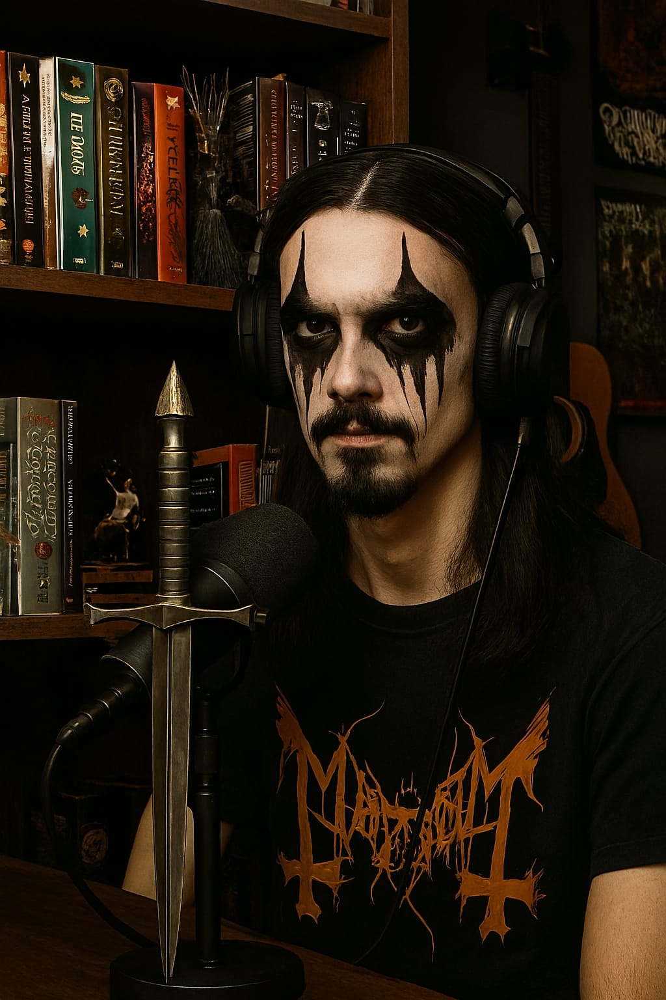

# Projeto Podcast Gerado por I.A.s

 > ℹ️ **NOTE:** Este é o repositório desenvolvido durante o Bootcamp Universia - Fundamentos de IA Generativa em conjunto com a DIO.

O projeto tem o objetivo de gerar um podcast utilizando ferramentas de IA.

🎙 Imagina um podcast que junta o peso do metal com o universo geek. Quem comanda essa viagem é o Björn — o metaleiro mais good vibes que você vai encontrar por aqui. Prepare-se pra riffs pesados, papos nerds e aquela energia que só ele sabe trazer! 🫡🤘

## 💻 Tecnologias utilizadas no projeto

- [Copilot](https://chat.openai.com/](https://copilot.microsoft.com/)) 
- [ElevenLabs](https://beta.elevenlabs.io/)

## ✨ Como foi feito ?

- Roteiro gerado via Copilot
- Audio gerado pela ElevenLabs
- Copilot para gerar capas

# Keep headbanging folks! 🤘🤘

